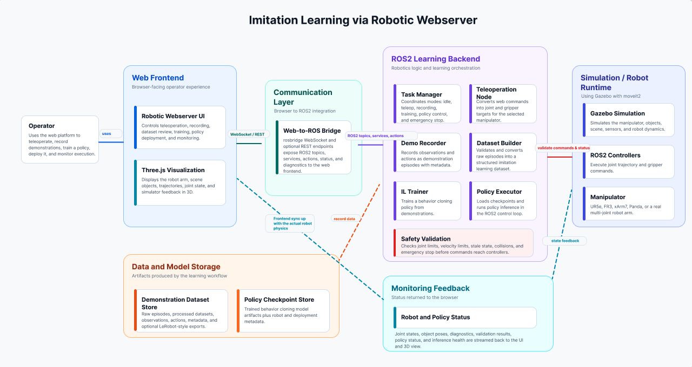
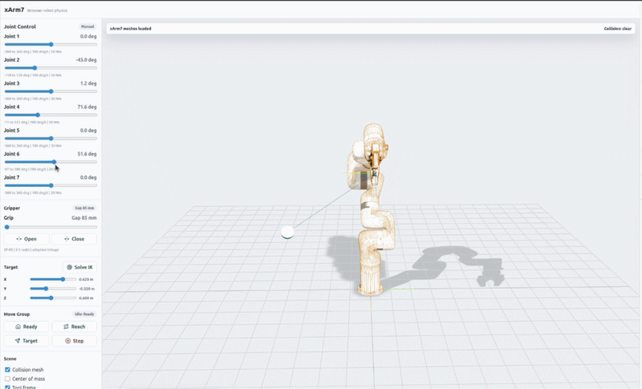
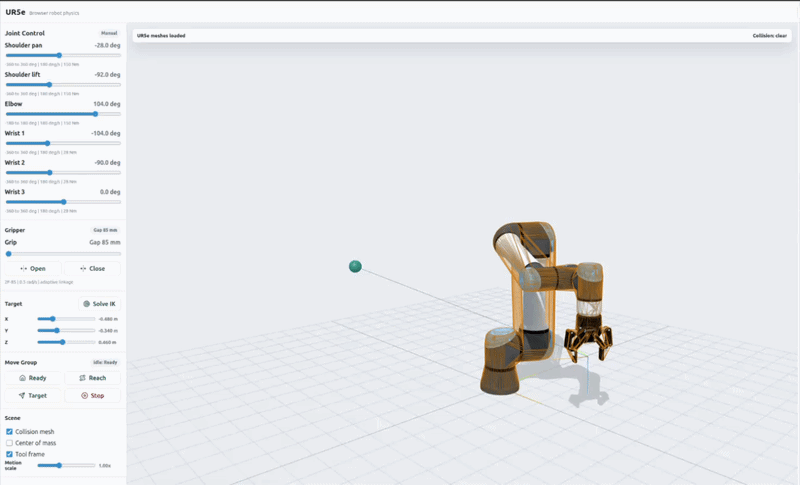
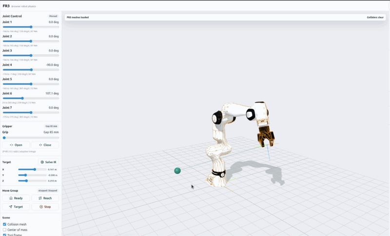
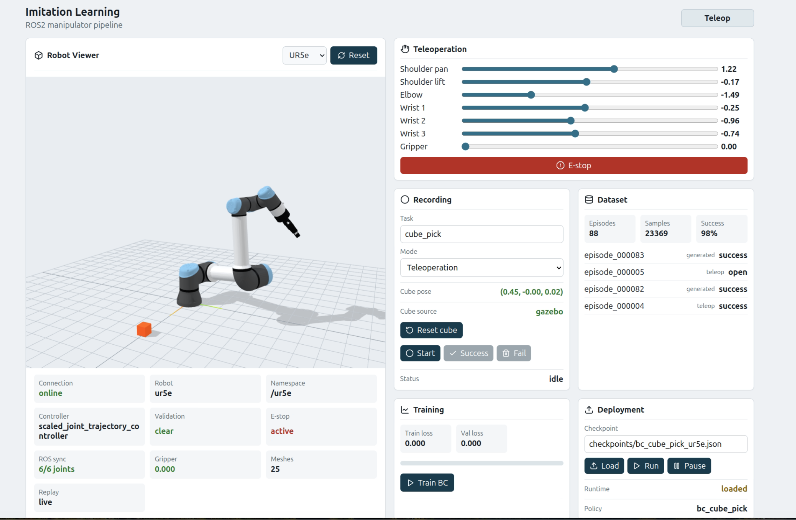
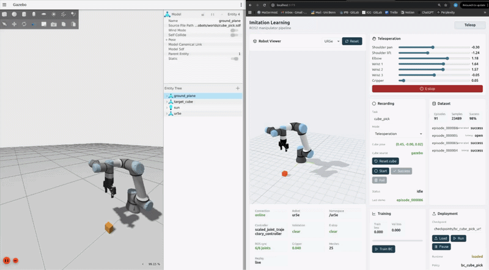
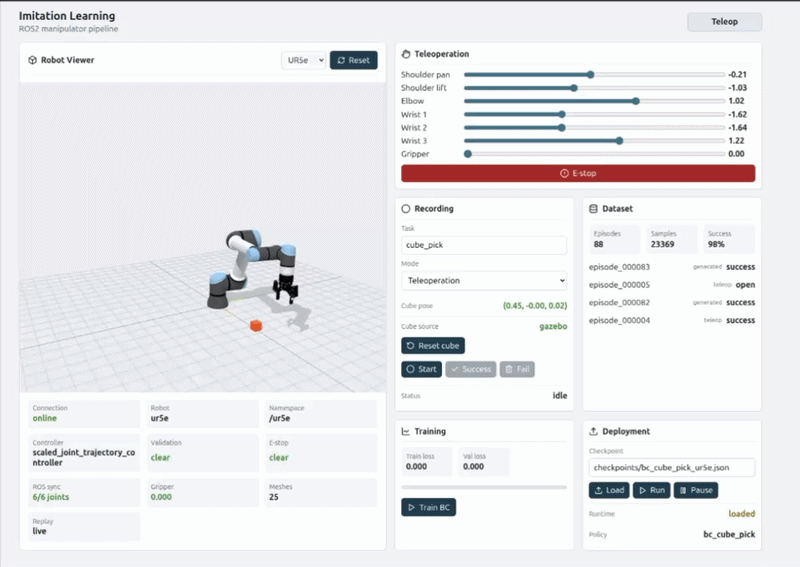
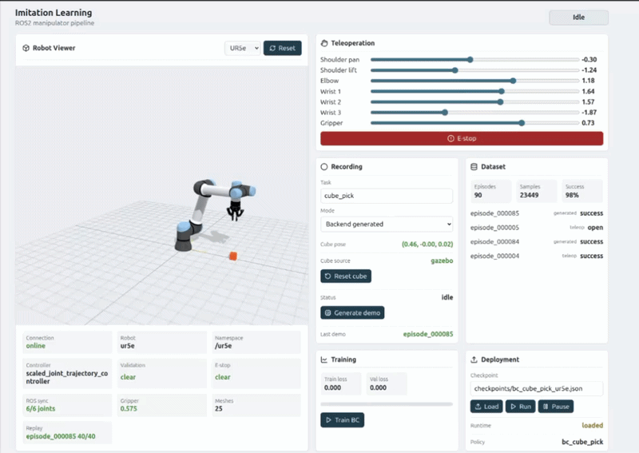

# Imitation Learning Pipeline for Teleoperated Robotic Manipulation in a ROS2 Webserver Platform

Details of manipulation-focused imitation learning pipeline by connecting browser teleoperation, ROS2 robot control, Gazebo simulation, dataset collection, behavior cloning training, and policy deployment through a webserver interface.


## Targeted imitation learning task

The targeted task is teleoperated pick-and-place style manipulation in simulation. The system records robot observations, such as joint state, gripper state, end-effector pose, and object pose, together with operator actions, then trains a behavior-cloning policy to predict the next safe manipulation command through the ROS2 control loop.

## Imitation learning pipeline

```text
Teleoperate robot from Web UI
-> Record observations and actions
-> Store demonstration episodes
-> Build training dataset
-> Train behavior cloning policy
-> Load policy checkpoint
-> Run policy through the ROS2 control loop
```

## Architecture diagram

[](https://www.figma.com/design/Cb6d1QYDuZrXgJxJ397W5o/Imitation-Learning?node-id=0-1)

*Click the diagram to open the editable Figma file.*

The web UI is robot-agnostic: Three.js only renders the arm, scene, and trajectories, while joint and object state arrive over the web-to-ROS bridge from Gazebo. The same screen supports teleoperation, demonstration recording, dataset inspection, training, and deployment; swapping arms is mostly configuration (robot description, joint names, controller topics, gripper, and visualization assets).

MoveIt2 provides the planning scene and state-validity checks so unsafe or infeasible teleoperation and policy commands are rejected before they reach the controllers.

For this prototype, I targeted and tested three robot arms:

- FR3
- UR5e
- xArm7


## Technical stack

- **Frontend:** Web UI with a robot-agnostic Three.js visualizer
- **Middleware:** ROS2 topics, services, actions, and rosbridge/WebSocket communication
- **Simulation:** Gazebo for robot motion, scene physics, and repeatable testing
- **Planning and validation:** MoveIt2 planning scene and state-validity checks
- **Control:** ROS2 controllers for joint trajectory and gripper execution
- **Learning:** behavior cloning from recorded observation-action demonstrations

## Dataset format

Each episode is stored as a time-indexed sequence of observation-action samples. 

```json
{
  "episode_id": "episode_000001",
  "robot_name": "ur5e",
  "task_name": "cube_pick",
  "source": "teleop",
  "success": true,
  "samples": [
    {
      "timestamp": 0.05,
      "observation": {
        "joint_position": [],
        "joint_velocity": [],
        "gripper_position": [],
        "ee_pose": [],
        "object_pose": []
      },
      "action": {
        "joint_position_target": [],
        "joint_delta": [],
        "gripper_command": []
      }
    }
  ]
}
```

## Safety and validation

Commands from both teleoperation and policy execution are checked before reaching the controllers. The validation layer can reject unsafe commands using joint limits, velocity limits, stale-state checks, MoveIt2 collision/state-validity checks, and emergency stop or policy pause handling.


## Robot-agnostic Three.js visualizer demos

The same Three.js visualizer and Web UI flow were tested with FR3, UR5e, and xArm7. The robot model, joint names, controller topics, and visualization assets are configurable, so the frontend is not tied to one specific arm.








## Web UI



The Web UI exposes the main imitation-learning workflow through four panels:

- **Recording:** select the task, choose teleoperation or backend-generated mode, reset the cube pose, and start/mark demonstration episodes.
- **Dataset:** inspect collected episodes, sample counts, success rate, and whether data came from teleoperation or backend generation.
- **Training:** trigger behavior-cloning training from the collected dataset and monitor training/validation loss.
- **Deployment:** load a trained checkpoint, run or pause the policy, and monitor whether the policy runtime is loaded.

### Gazebo and Three.js frontend synchronization

The browser visualizer is synchronized with the actual Gazebo simulation. The robot motion is simulated in Gazebo, published through ROS2, and mirrored in the Three.js frontend through the web-to-ROS bridge.



### Sending teleoperation from the webserver

The operator sends teleoperation commands directly from the webserver UI. The frontend publishes the command through the ROS2 bridge, while the actual physics, robot motion, joint updates, and scene feedback come from the Gazebo simulation and ROS2 controllers.



In addition to manual teleoperation, demonstration data can also be generated from the backend. This is useful for quickly creating repeatable sample episodes for testing dataset conversion, training, and policy deployment without manually recording every run.




## Future work

- Clean the actual pipeline code for a public GitHub release.
- Improve the current behavior cloning approach with a stronger policy model and better evaluation.
- Extend the learning pipeline toward reinforcement learning in simulation.
